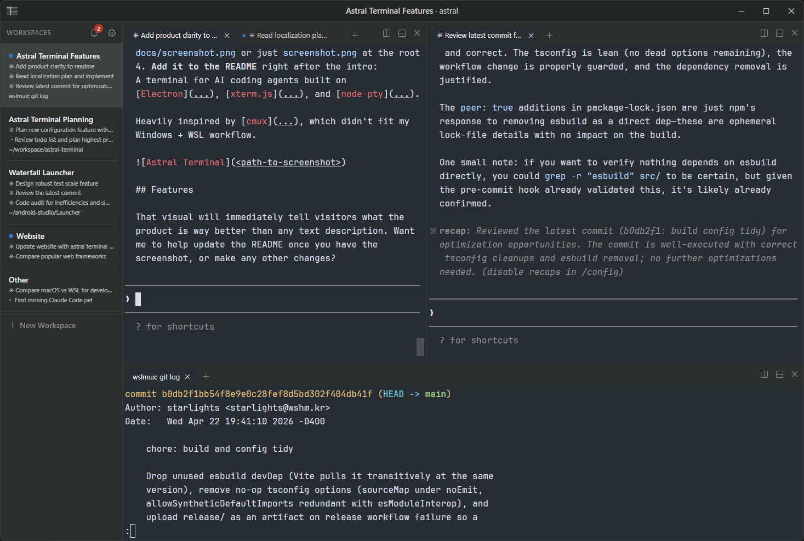

<h1> Astral Terminal</h1>

A terminal for running and supervising multiple AI coding agents in parallel, built on [Electron](https://www.electronjs.org/), [xterm.js](https://xtermjs.org/), and [node-pty](https://github.com/microsoft/node-pty).

Heavily inspired by [cmux](https://github.com/manaflow-ai/cmux), which didn't fit my Windows + WSL workflow.



## Features

✅ Done | 🚧 Partial | 🔲 Planned

| Status | Feature |
| :-: | --- |
| ✅ | First class support for Windows + WSL |
| 🔲 | Cross-platform support for Linux / MacOS |
| ✅ | Organized workspaces with split panes and tabs |
| 🚧 | Configurable themes and notifications |
| ✅ | Notification inbox with jump-to-unread |
| ✅ | Built-in Claude Code hook notifications |
| 🔲 | Hook notifications for other agents |
| ✅ | Scrollback survives restarts |
| 🔲 | Agent auto-resume on restarts |
| 🔲 | Scriptable CLI |
| 🔲 | In-app browser |

## Getting started

Built and tested on Node 22.

```bash
npm install
npm run dev
```

## Credits

- Font: [JetBrains Mono](https://www.jetbrains.com/lp/mono/)
- Terminal theme: [One Half](https://github.com/sonph/onehalf)
- Icons: [Codicons](https://github.com/microsoft/vscode-codicons), [Simple Icons](https://simpleicons.org/) (via [react-icons](https://github.com/react-icons/react-icons))
